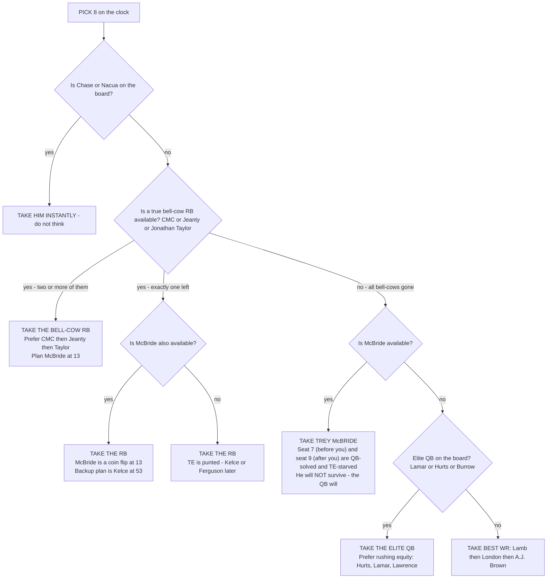
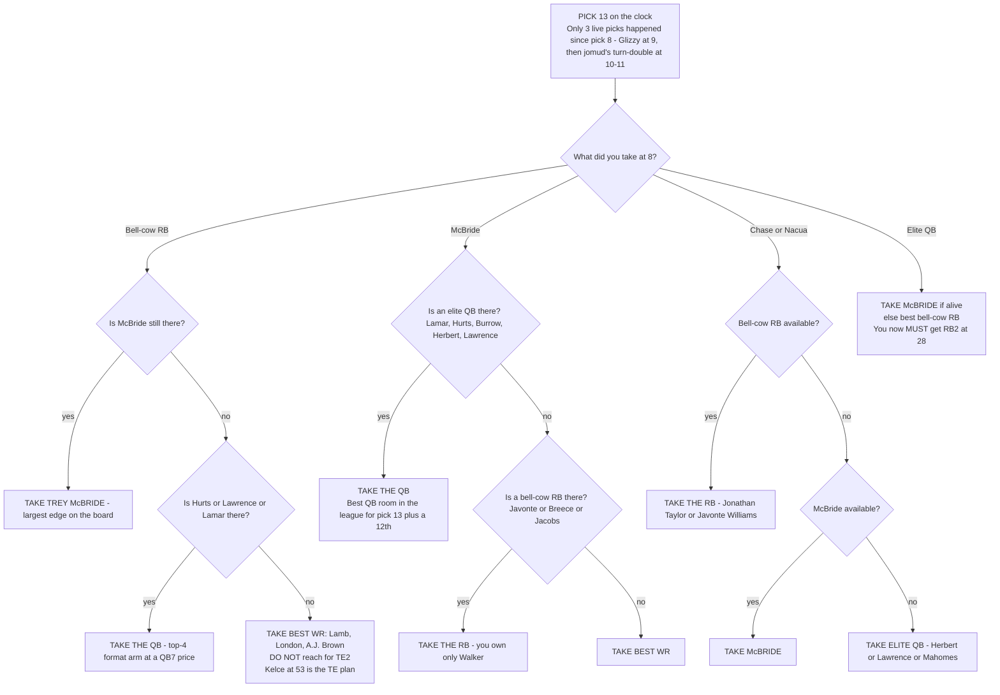
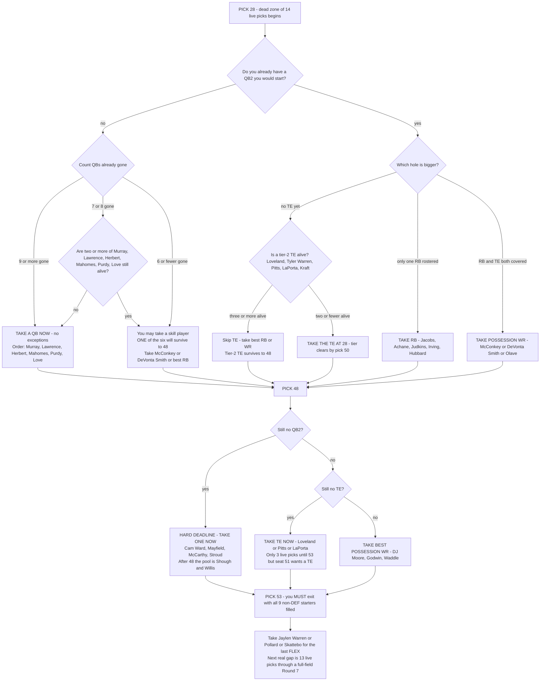
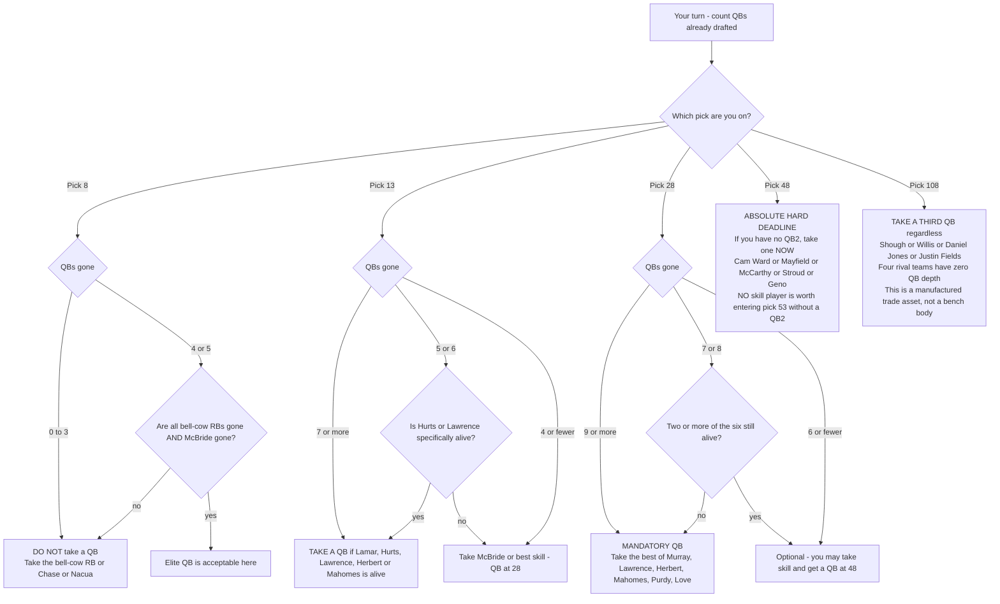
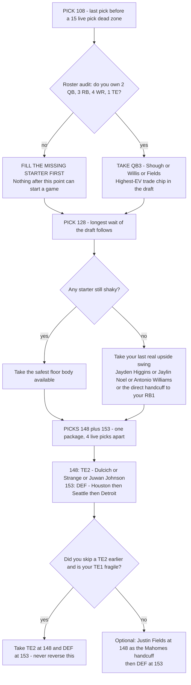

# Sunday Scaries 2026 — Draft Board & Slot-8 Game Plan

*10-team superflex keeper league · half-PPR + 0.5 per first down · snake draft, Wed Aug 28 7:30pm ET*

**Andrew drafts from SLOT 8.** Keepers: Kenneth Walker III (costs R4), Bo Nix (R12), Jameson Williams (R14).

**Live picks:** 8, 13, 28, 48, 53, 68, 73, 88, 93, 108, 128, 148, 153

---

# SUNDAY SCARIES 2026 — DRAFT VALUE BOARD
### Andrew (andrewroth32) · Slot 8 · 10-team Superflex · Half-PPR + 0.5/First Down
### Draft: Wed Aug 28, 2026, 7:30pm ET · 16 rounds · 160 picks · 130 live picks

**Keepers locked:** Kenneth Walker III (R4), Bo Nix (R12), Jameson Williams (R14)
**Live picks:** 8, 13, 28, 48, 53, 68, 73, 88, 93, 108, 128, 148, 153
**Roster holes:** QB2, RB2, WR2, TE, 2×FLEX, DEF + 6 bench = **13 bodies from 13 picks.** Zero margin for a wasted pick.

> **Flag before we start:** Your own R2 keeper slot held **Puka Nacua** — the single best format fit in football (34.8% target rate, 129 catches, 3.57 YPRR) — and you're letting him back into the pool. The surplus math justifies it (Nix at R12 and Jameson Williams at R14 are ~90-pick surpluses vs. Nacua's ~9-pick surplus), so the decision is correct. But understand the consequence: **Nacua is live at pick 1.01 and will not reach pick 8.** Don't sit there hoping.

---

## 1. SUPPLY-AND-DEMAND MODEL

### 1a. What the 30 predicted keepers remove

| Team | Kept | Pos removed |
|---|---|---|
| Pabst Interference | James Cook, Khalil Shakir, Aaron Rodgers | RB, WR, QB |
| **Andrew** | **K. Walker, Bo Nix, Jameson Williams** | RB, QB, WR |
| Water/Barkley/Hops | Saquon Barkley, Mark Andrews, David Montgomery | RB, TE, RB |
| jomud | Chase Brown, Dak Prescott, Nico Collins | RB, QB, WR |
| Glizzy Guzzler | Bijan Robinson, Caleb Williams, Jaxson Dart | RB, QB, QB |
| Mass General | Justin Jefferson, Derrick Henry, Jaxon Smith-Njigba | WR, RB, WR |
| Still at RPI | Drake Maye, Brock Bowers, Omarion Hampton | QB, TE, RB |
| Ethan's Younglings | Jahmyr Gibbs, Jayden Daniels, Sam Darnold | RB, QB, QB |
| DannyBC1 | Amon-Ra St. Brown, Kyren Williams, Travis Etienne | WR, RB, RB |
| Big Mommy Milkers | Terry McLaurin, Zay Flowers, George Kittle | WR, WR, TE |

**Positional totals removed: QB 8 · RB 11 · WR 8 · TE 3 = 30.**

### 1b. Supply vs. demand after keepers

League starting slots = 100 (10 QB, 20 RB, 20 WR, 10 TE, 20 FLEX, 10 SUPERFLEX, 10 DEF). SUPERFLEX is functionally QB → **20 QB-eligible slots.**

| Pos | Startable NFL pool | Removed by keepers | Live supply | Starter slots still to fill from draft | **Supply : Demand** |
|---|---|---|---|---|---|
| **RB** | ~30 fantasy-startable | **11** (and they're 11 of the top ~20) | **19** | 9 dedicated + ~10 FLEX = **19** | **1.00 — TIGHTEST** |
| **TE** | ~14 usable TE1s | 3 (Andrews, Bowers, Kittle) | **11** | 7 dedicated + ~2 FLEX = **9** | **1.22** (but *1 elite for 7 needy teams*) |
| **QB** | ~24 NFL starters | 8 | **16** | **12** (20 slots − 8 kept) | **1.33** overall / **1.08 in the top 12** |
| **WR** | ~40 startable | 8 | **32** | 12 dedicated + ~8 FLEX = **20** | **1.60 — DEEPEST** |

### 1c. The QB demand map (this is the number that drives everything)

| QB rooms after keepers | Teams | QBs still needed |
|---|---|---|
| **Zero QBs kept** | havicht, Mass General, DannyBC1, Big Mommy Milkers | **4 teams × 2 = 8** |
| **One QB kept** | Pabst (Rodgers), **Andrew (Nix)**, jomud (Prescott), RPI (Maye) | 4 teams × 1 = **4** |
| **Two QBs kept — done** | Glizzy Guzzler, Ethan's Younglings | 0 |
| | | **12 total** |

The critical structural fact: **keepers stripped the MIDDLE of the QB board, not the top.** Every keeper QB (Rodgers, Nix, Prescott, C. Williams, Dart, Maye, Daniels, Darnold) is a QB5–QB18 type. All four elite arms — **Josh Allen, Lamar Jackson, Joe Burrow, Jalen Hurts** — plus Herbert, Lawrence, Mahomes, Purdy, Kyler Murray, Stafford, Goff, Love, Stroud, Mayfield, McCarthy, Cam Ward are **all live.** That's ~16 startable arms for 12 slots.

**Where the QB cliff lands relative to your picks:**

| Range | Cumulative QBs off board | What's left |
|---|---|---|
| Picks 1–10 | 4–5 | Allen, Lamar, Burrow, Hurts mostly gone |
| **Pick 13 (yours)** | **5–6** | Herbert / Lawrence / Mahomes tier |
| **Pick 28 (yours)** | **10–11** | Purdy, K. Murray, Stafford, Goff, Love, Stroud |
| **Pick 48 (yours)** | **14–15** | Mayfield, McCarthy, Cam Ward, Geno |
| Pick 68 | 17–18 | Shough, Bryce Young, Willis, D. Jones, Fields |

**QB cliff = between your pick 28 and your pick 48.** That is the single most actionable number in this document.

### 1d. Where the RB and TE cliffs land

**True bell-cows live in the pool: exactly 10** — McCaffrey, Jeanty, Jonathan Taylor, Josh Jacobs, Javonte Williams, Breece Hall, De'Von Achane, Quinshon Judkins, Chuba Hubbard, Bucky Irving. Ten workhorses, ten teams, and the format widens (does not narrow) the gap between workhorses and committees because every extra touch is a first-down lottery ticket. **RB cliff is inside Round 1 — it lands at your pick 8.** After roughly pick 30 there is not a single uncontested three-down back left.

**Elite TE live in the pool: exactly 1 — Trey McBride** (169 targets / 126 catches / 1,239 yds in 2025). Bowers, Kittle and Andrews are all kept. **7 of 10 teams have zero TE** (Pabst, Andrew, jomud, Glizzy, Mass General, Ethan's, DannyBC1). **TE cliff #1 is McBride vs. everyone — it lands at your pick 13.** TE cliff #2 (Warren/Loveland/Pitts/LaPorta/Kraft → Kelce/Goedert/Hockenson) lands around picks 45–55, i.e. right on your 48/53 turn.

**Verdict: RB is genuinely the scarcest position, TE is the scarcest single *asset*, QB is scarce only in a narrow band (QB10–QB16) that expires between your picks 28 and 48, and WR is a commodity you should never pay a premium for in this draft.**

---

## 2. ROUND-BY-ROUND KEEPER DEPLETION MAP

Keeper costs consumed by round (from the predicted keeper set):

| Rd | Picks consumed by keepers | **Live picks in round** | Andrew's pick | Environment |
|---|---|---|---|---|
| 1 | 0 | **10** | **p8** | Full field. Fight for it. |
| 2 | 4 (Glizzy, MassGen, Ethan's, Danny) | **6** | **p13** | **RICHEST round in the draft** |
| 3 | 4 (Pabst, havicht, RPI, Danny) | **6** | **p28** | **RICHEST round in the draft** |
| 4 | 4 (**Andrew**, jomud, Glizzy, MassGen) | 6 | — (forfeit) | You're not here |
| 5 | 2 (jomud, Ethan's) | 8 | **p48** | Slightly thin field |
| 6 | 1 (Big Mommy) | 9 | **p53** | Near-full field |
| 7 | **0** | **10** | **p68** | **Full field — most competitive mid-round** |
| 8 | 3 (havicht, RPI, Big Mommy) | 7 | **p73** | Favorable |
| 9 | 2 (havicht, Big Mommy) | 8 | **p88** | Neutral |
| 10 | 1 (Danny) | 9 | **p93** | Near-full |
| 11 | 1 (Pabst) | 9 | **p108** | Near-full |
| 12 | 2 (**Andrew**, Ethan's) | 8 | — (forfeit) | You're not here |
| 13 | 3 (jomud, Glizzy, RPI) | 7 | **p128** | Favorable |
| 14 | 2 (**Andrew**, MassGen) | 8 | — (forfeit) | You're not here |
| 15 | 1 (Pabst) | 9 | **p148** | Near-full |
| 16 | **0** | **10** | **p153** | Full field |

### 2a. Your REAL waits, measured in live picks (not nominal picks)

This is the correction that changes your strategy. The "19-pick dead zone" is mostly an illusion; the *real* dead zones are elsewhere.

| Gap | Nominal picks | **Expected LIVE picks between** | Reality |
|---|---|---|---|
| p8 → p13 | 4 | **3.2** | Effectively back-to-back |
| p13 → p28 | 14 | **8.4** | Much softer than it looks (R2/R3 are 60% live) |
| **p28 → p48** | **19** | **12.8** | Real, but not the worst |
| p48 → p53 | 4 | 3.4 | Back-to-back |
| **p53 → p68** | **14** | **13.3** | ⚠️ **As bad as the "dead zone" — R7 has ZERO keepers** |
| p68 → p73 | 4 | 3.4 | Back-to-back |
| p73 → p88 | 14 | 10.5 | Moderate |
| p88 → p93 | 4 | 3.4 | Back-to-back |
| p93 → p108 | 14 | 12.6 | Moderate |
| **p108 → p128** | **19** | **14.7** | ⚠️ Real dead zone |
| **p128 → p148** | **19** | **15.7** | ⚠️ **Longest actual wait of the draft** |
| p148 → p153 | 4 | 3.8 | Back-to-back |

**Two headline findings:**
1. **Your p13 → p28 wait is only ~8 live picks.** You can afford to be greedy at 13 and still expect a Tier-3 player at 28. Round 2 and Round 3 each have only 6 live picks — 40% of the field is skipping those rounds.
2. **The p53 → p68 gap (13.3 live picks) is functionally as dangerous as the celebrated p28→p48 dead zone,** because Round 7 is the only mid-round with a completely full 10-team field. Everyone picks in Round 7. Plan for it exactly like a dead zone.

---

## 3. MASTER VALUE TIER TABLE

Format markers: **↑↑** big riser under 0.5/first-down · **↑** riser · **↓** faller · **↓↓** big faller · (–) neutral

| Tier | Players (live in the pool) | Maps to Andrew's picks |
|---|---|---|
| **T1 — Untouchable** | Ja'Marr Chase WR (–), **Puka Nacua WR ↑↑**, Josh Allen QB ↑↑, Lamar Jackson QB ↑↑, Christian McCaffrey RB ↑↑, Joe Burrow QB **↓** (zero rush equity) | **Gone by pick 6.** Not yours. |
| **T2 — Andrew's pick-8/13 window** | **Ashton Jeanty RB ↑↑** (55 catches as a rookie), **Jonathan Taylor RB ↑**, CeeDee Lamb WR (–), **Trey McBride TE ↑↑** (169 tgts — biggest single-position edge on the board), Jalen Hurts QB ↑↑, Drake London WR ↑ (37.4% first-read rate), Justin Herbert QB **↓**, Trevor Lawrence QB ↑ (359 rush yds/9 rush TD) | **p8, p13** |
| **T3 — Late R2 / R3** | A.J. Brown WR (–), Malik Nabers WR (–, ACL), **Javonte Williams RB ↑↑**, Breece Hall RB (–), Josh Jacobs RB (–, conduct risk), De'Von Achane RB **↓**, **Ladd McConkey WR ↑↑**, **DeVonta Smith WR ↑↑** (now PHI alpha), **Chris Olave WR ↑**, Rashee Rice WR ↑, Garrett Wilson WR (–), Tee Higgins WR (–), **Emeka Egbuka WR ↑↑**, Patrick Mahomes QB **↓** (ACL, lost scramble equity), **Kyler Murray QB ↑↑**, Brock Purdy QB ↓, Quinshon Judkins RB **↓↓** (~30 catches, TD-dependent), Bucky Irving RB ↑ | **p28** (and the tail of it reaches **p48**) |
| **T4 — R4/R5 equivalent** | Matthew Stafford QB ↓↓, Jared Goff QB ↓↓, Jordan Love QB (–), C.J. Stroud QB (–), Baker Mayfield QB (–), J.J. McCarthy QB (–), **Cam Ward QB ↑**, **Colston Loveland TE ↑↑**, Tyler Warren TE **↓** (QB-dependent, big-play reliant), **Kyle Pitts TE ↑** (118 tgts), Sam LaPorta TE ↑, Tucker Kraft TE (–, ACL return), **DJ Moore WR ↑**, Jaylen Waddle WR ↑, Davante Adams WR ↓, **Mike Evans WR ↓**, **Tetairoa McMillan WR ↓** (contested-catch profile), Chuba Hubbard RB (–), Cam Skattebo RB ↑ (if ankle clears), D'Andre Swift RB (–), TreVeyon Henderson RB (–), Rhamondre Stevenson RB (–) | **p48, p53** |
| **T5 — R6/R7** | **Travis Kelce TE ↑↑** (your own R7 discard; still elite catch-rate chain-mover), Dallas Goedert TE **↓** (11 TD = TD-spike dependent), T.J. Hockenson TE (–), **Jake Ferguson TE ↑**, Dalton Kincaid TE ↑, **David Njoku TE ↑**, **Chris Godwin WR ↑↑**, **Jakobi Meyers WR ↑↑**, **Jayden Reed WR ↑↑**, Jordan Addison WR ↓, Luther Burden WR (–), **Rome Odunze WR ↓↓** (29.3% deep-tgt rate), **George Pickens WR ↓**, **Marvin Harrison Jr. WR ↓↓**, **Brian Thomas Jr. WR ↓↓**, **DK Metcalf WR ↓↓**, **Courtland Sutton WR ↓↓**, **Xavier Worthy WR ↓↓**, **Jaylen Warren RB ↑↑** (Rodgers checkdown back), Tony Pollard RB ↑, Aaron Jones RB ↑, Joe Mixon RB (–) | **p53, p68, p73** |
| **T6 — R8/R9** | **Michael Pittman WR ↑**, **Stefon Diggs WR ↑**, Deebo Samuel WR (–), Jauan Jennings WR ↑, Darnell Mooney WR ↓, **Woody Marks RB ↑↑** (inherits Mixon's HOU passing-down role), RJ Harvey RB (–), Jordan Mason RB (–), Najee Harris RB ↓, **Alvin Kamara RB ↓**, Tyrone Tracy RB (–), Bhayshul Tuten RB ↓, Rico Dowdle RB (–), Chig Okonkwo TE ↑, Hunter Henry TE (–), Harold Fannin TE ↑ | **p73, p88** |
| **T7 — R9/R10** | **Josh Downs WR ↑↑** (80% slot rate — highest in the NFL, purest format asset available this late), **Wan'Dale Robinson WR ↑↑** (185 catches/33 gms), Ricky Pearsall WR (–), Matthew Golden WR (–), **Quentin Johnston WR ↓↓**, Christian Watson WR ↓↓, **Justice Hill RB ↑↑** (receiving handcuff), **Jordan James RB ↑↑** (CMC handcuff — best handcuff in football), **Samaje Perine RB ↑**, Blake Corum RB (–), Isaiah Likely TE ↓, Brenton Strange TE ↑, Juwan Johnson TE ↑ | **p88, p93** |
| **T8 — R11** | **Tyler Shough QB ↑** (QB12 pace from Wk9 on), **Malik Willis QB ↑↑** (44.8 rush yds/gm as a starter), Geno Smith QB ↓, Bryce Young QB (–), Daniel Jones QB ↑, Jaydon Blue RB (–), Kyle Monangai RB (–), Isiah Pacheco RB (–), Zach Charbonnet RB (–), DJ Giddens RB (–), Jalen Coker WR ↑ (10.1 HPPR final 9 gms), Jonathon Brooks RB (–) | **p108** |
| **T9 — R13/R15** | **Jalen Nailor WR ↑**, **Antonio Williams WR ↑** (2.27 YPRR, vacated WAS slot), **Jaylin Noel WR ↑**, **Jayden Higgins WR ↑** (24% TPRR down the stretch), Ryan Flournoy WR ↓, Alec Pierce WR ↓↓, **Greg Dulcich TE ↑↑** (2.31 YPRR, gutted MIA WR room), Dalton Schultz TE ↓, Cade Otton TE ↓, AJ Barner TE (–), Tank Bigsby RB ↓, MarShawn Lloyd RB (–), Brian Robinson RB (–), Jaylen Wright RB (–), **Justin Fields QB ↑↑** (Mahomes handcuff — top-15 format asset the day Mahomes' knee goes) | **p128, p148** |
| **T10 — R16 / DEF** | **Houston DST**, **Seattle DST**, LA Rams DST, Denver DST (schedule risk), Detroit DST (easiest Wk1–5 slate), Baltimore DST, LAC DST · Fernando Mendoza QB stash, Anthony Richardson QB stash | **p153** |

**Format-inflation summary you must internalize:** in this scoring, a 7-catch / 55-yard / 5-first-down day (**12.0 pts**) equals a 2-catch / 70-yard / 1-TD day (**12.0 pts**). The possession player does that every week; the deep threat does it four times a year. **Systematically fade Worthy, Metcalf, Sutton, Odunze, MHJ, Brian Thomas Jr., Pickens, Judkins, Goedert, Goff/Stafford. Systematically buy McBride, Kelce, Downs, Wan'Dale, Godwin, Meyers, Reed, McConkey, DeVonta Smith, Jaylen Warren, Woody Marks, Justice Hill, Kyler Murray, Cam Ward, Willis.**

---

## 4. PICK-BY-PICK TARGET TABLE

| Pick | Rd | Realistic pool at that pick | **PRIMARY TARGET** | Fallback A | Fallback B | Position priority |
|---|---|---|---|---|---|---|
| **8** | 1 | 4–5 QBs, Chase, Nacua, CMC gone. Left: Jeanty, J. Taylor, Lamb, London, McBride, Herbert, Lawrence, A.J. Brown, possibly Hurts | **Ashton Jeanty (RB)** — 321 touches + 55 catches as a rookie in a bad situation, better OL in Yr2; dual rush+rec first-down engine. This is the last pick where a true bell-cow is available. | **Jonathan Taylor (RB)** | **CeeDee Lamb (WR)** | **RB > elite WR > TE > QB.** If Chase or Nacua improbably falls, take him instantly. |
| **13** | 2 | ~8 more picks gone, ~3 live. Left: McBride (if he survives), Lamb/London, A.J. Brown, Nabers, Breece, Javonte, Herbert/Lawrence | **Trey McBride (TE)** — the only 160-target TE in the pool, 7 rival teams have zero TE, and the FD bonus makes him a WR1 in scoring (~250 pts vs. ~150 for TE10). **Largest positional edge on the entire board.** | **CeeDee Lamb / Drake London (WR)** | **Javonte Williams (RB)** — DAL bell-cow, 16.5+ HPPR in 6 of 9 games | **TE > WR > RB > QB.** If McBride is gone at 13, do NOT reach for TE2 here — take the WR and get Loveland/Pitts/Kelce at 48/53. |
| **28** | 3 | Only 6 live picks in R3. ~10–11 QBs gone. Left: Purdy, K. Murray, Stafford, Goff, Love, Stroud; McConkey, DeVonta Smith, Olave, Egbuka, Higgins; Judkins, Irving, Hubbard | **Kyler Murray (QB)** if live — MIN job w/ Jefferson/Addison/Hockenson + 30–40 rush yds/gm floor the format double-pays. Else **Trevor Lawrence / Justin Herbert / Patrick Mahomes / Brock Purdy**, in that order. | **Ladd McConkey (WR ↑↑)** | **DeVonta Smith (WR ↑↑)** — PHI's true alpha now that A.J. Brown is in NE | **QB > WR > RB.** This is your QB deadline-minus-one. See §5. |
| **48** | 5 | ~14 QBs gone. Left: Loveland, Pitts, LaPorta, Kraft, Kelce; DJ Moore, Waddle, Adams, Evans, Burden, Godwin; Pollard, A. Jones, Warren, Skattebo, Swift | **Best WR2 available — DJ Moore (↑) or Jaylen Waddle (↑)**. If you punted QB at 28: **Cam Ward / Baker Mayfield / J.J. McCarthy — HARD DEADLINE, take one.** | **Chris Godwin (WR ↑↑)** | **Colston Loveland (TE ↑↑)** if McBride was missed at 13 | **WR2 (or QB if punted) > TE-if-missed > RB** |
| **53** | 6 | 3.4 live picks after 48 — treat as a package with p48 | **RB2/FLEX — Jaylen Warren (RB ↑↑)** or **Tony Pollard (RB ↑)**. Warren is the designated Rodgers checkdown back: pure format gold. | **Cam Skattebo (RB ↑)** if ankle cleared | **Travis Kelce (TE ↑↑)** if TE still open | **RB > TE > WR.** Both starting FLEX slots must be filled by end of 53 — the next real gap is 13.3 live picks. |
| **68** | 7 | ⚠️ **Full 10-team field, zero keepers in R7 — most competitive round of the mid-draft.** Left: Meyers, Godwin, Reed, Addison, Burden, Pittman, Diggs; Ferguson, Kincaid, Njoku, Hockenson; A. Jones, Harvey, Mason, Marks | **Jakobi Meyers (WR ↑↑)** or **Jayden Reed (WR ↑↑)** — high-floor slot chain-movers, 2–3 rounds of value vs. standard ADP | **Michael Pittman Jr. (WR ↑)** | **Jake Ferguson / David Njoku (TE ↑)** as TE2 | **WR3 > RB depth > TE2** |
| **73** | 8 | 7 live picks in R8 — favorable | **Woody Marks (RB ↑↑)** — inherits Mixon's HOU early-down + passing-down role; a genuine format riser at a bench price | **Stefon Diggs (WR ↑)** | **Rico Dowdle / Aaron Jones (RB)** | **RB depth > WR > TE2** |
| **88** | 9 | Left: Downs, Wan'Dale, Pearsall, Jennings, Golden; Okonkwo, H. Henry, Fannin, Strange; Tracy, Tuten, Harvey | **Josh Downs (WR ↑↑)** — 80% slot rate, the highest in the NFL. In a 0.5-FD league this is the best value on the board relative to ADP. | **Wan'Dale Robinson (WR ↑↑)** | **Chig Okonkwo (TE ↑)** — clear WAS #2 target with 171 vacated targets | **WR possession > TE2 > RB** |
| **93** | 10 | 3.4 live picks after 88 — package with p88 | **Jordan James (RB ↑↑)** — the single most valuable handcuff in football behind CMC's injury history; standalone flex value if CMC misses time | **Justice Hill (RB ↑↑)** — receiving back behind a 32-yr-old Henry | **Samaje Perine (RB ↑)** | **Pass-catching handcuff RB > WR > QB3** |
| **108** | 11 | ⚠️ **Last pick before a 14.7-live-pick dead zone.** Left: Shough, Willis, Geno, Bryce Young, D. Jones; Blue, Monangai, Pacheco, Corum, Charbonnet; Coker, Nailor | **Tyler Shough (QB)** or **Malik Willis (QB ↑↑)** — dual purpose: bye-week SUPERFLEX insurance **and a trade chip**, because four rival teams (havicht, Mass General, DannyBC1, Big Mommy) will be one injury from a dead SF slot all season | **Jalen Coker (WR ↑)** — 10.1 HPPR over his final 9 games | **Blake Corum / Isiah Pacheco (RB)** | **QB3-as-asset > WR upside > RB handcuff** |
| **128** | 13 | ⚠️ **Before the longest gap of the draft (15.7 live picks).** 7 live picks in R13. Left: Nailor, A. Williams, Noel, J. Higgins, Flournoy; Dulcich, Strange, Barner; Brooks, Bigsby, Lloyd | **Jayden Higgins or Jaylin Noel (WR ↑)** — Yr-2 Texans climbing a short-passing target tree; Higgins hit a 24% TPRR down the stretch | **Antonio Williams (WR ↑)** — 2.27 YPRR into a vacated WAS slot role | **Jonathon Brooks (RB)** — fully healthy, glowing camp, behind a Hubbard who fell RB15→RB38 | **WR upside > RB lottery > TE2** |
| **148** | 15 | 9 live picks in R15. Thin. | **Greg Dulcich (TE ↑↑)** — 2.31 YPRR (most efficient TE per snap) into a gutted Miami WR room; your TE2 | **Brenton Strange (TE ↑)** — TE12 over a 7-game stretch at a waiver price | **Justin Fields (QB ↑↑)** — the best "if he plays" asset in the league; Mahomes' knee is one hit from making him a top-15 format QB | **TE2 > QB stash > RB dart** |
| **153** | 16 | Full 10-team field, ~8 DSTs still live | **Houston DST** — DST2 in 2025, 3rd-fewest PPG allowed, projects DST1 | **Seattle DST** — highest-scoring DST in 2025 (17.2 PPG allowed), opens vs. NE/ARI | **Detroit DST** — easiest Wk1–5 schedule in football | **DEF.** Never earlier. Stream from Week 1 waivers anyway. |

---

## 5. THE QB QUESTION — DEFINITIVE ANSWER

### **Do NOT take an elite QB at pick 8 or pick 13. Take your QB2 at pick 28, with pick 48 as the absolute hard deadline.**

**The supply numbers that force this conclusion:**

1. **You already own a SUPERFLEX starter.** Bo Nix is confirmed healthy ("nothing's holding me back"), unquestioned in Denver, has a real scrambling floor the FD bonus pays for, and — critically — cost you a **12th-round pick.** Four rival teams have **zero** QBs. Your marginal need for QB is the 9th-most-urgent in a 10-team league.

2. **12 QB starting slots, ~16 startable arms live.** That's a 1.33 ratio — the *second-loosest* position on the board. Compare RB at 1.00.

3. **You need QB *#12*, not QB *#4*.** The four zero-QB teams need eight arms; they will pay picks 1–20 prices for the top of the tier. You need one arm that is better than replacement. The delta between the QB you'd take at pick 8 (say Jalen Hurts) and the QB you'd take at pick 28 (say Kyler Murray or Brock Purdy) is roughly **60–70 fantasy points over a season.** The delta between the RB you'd take at pick 8 (Jeanty, ~280 format points) and the RB you'd take at pick 48 (Swift/Stevenson, ~180) is **~100 points**, and the delta between McBride at 13 (~250) and the TE you'd get at 53 (~165) is **~85 points.** Spending pick 8 on a QB costs you ~185 points across two positions to gain ~65 at one.

4. **Two rival teams (Glizzy Guzzler and Ethan's Younglings) have their QB rooms fully solved** and will never bid against you. That's a 20% reduction in QB demand that nobody at the table is pricing in.

5. **The cliff is between your picks 28 and 48, not before 13.** Expected QBs gone: ~5–6 by p13, ~10–11 by p28, ~14–15 by p48. At 28 you're picking from **Purdy / Kyler Murray / Stafford / Goff / Love / Stroud** — genuine weekly SUPERFLEX starters. At 48 you're down to **Mayfield / McCarthy / Cam Ward / Geno.** At 68 you're at **Shough / Willis / Bryce Young** — streamers, not starters.

**The one exception that overrides everything:** if **Jalen Hurts or Trevor Lawrence is somehow on the board at pick 13**, take him. Hurts' value is now almost entirely concentrated in short-yardage designed runs — the exact stat this league pays twice for (0.5 FD + 0.1/yd) — and Lawrence added 359 rush yards / 9 rush TDs under Liam Coen. Either at pick 13 is a top-4 format QB at a QB7 price, and pairing him with Nix would give you the best SUPERFLEX room in the league plus a tradeable surplus. **Do not do this at pick 8** — pick 8 is your only shot at a bell-cow RB.

**Decision rule for pick 28, in order:** Kyler Murray → Trevor Lawrence → Justin Herbert → Patrick Mahomes → Brock Purdy → Jordan Love. **If all six are gone, pivot to McConkey/DeVonta Smith at 28 and take Cam Ward or Baker Mayfield at 48 — but you must not leave pick 48 without a QB2.**

**Bonus play:** take a 3rd QB at pick 108 (Shough or Willis). Four teams will be one QB injury from a hole in their most valuable lineup slot. A $0 QB3 is the highest-EV trade asset you can manufacture in this league.

---

## 6. POSITIONAL RUNS TO ANTICIPATE

### The QB run — **starts at pick 1, peaks picks 1–20, second wave picks 21–40**
**Drivers:** havicht (0 QBs, "most QB-desperate team in the league"), Mass General (0 QBs, Burrow ineligible so their own guy is in the pool), DannyBC1 (0 QBs despite rostering Stroud/Lawrence/Geno), Big Mommy Milkers (0 QBs *and* 0 RBs — the most cornered team at the table).

- Picks 1–10: **4–5 QBs** (Allen, Lamar, Burrow, Hurts + one of Herbert/Lawrence).
- Picks 11–20: **3–4 more** as the desperate teams take QB2 or grab a slider.
- Picks 21–40: **~4 more** as the 1-QB teams (Pabst needs a Rodgers successor, RPI needs a Maye partner) fill in.

**Your play: FADE the first wave completely, then front-run the tail at pick 28.** You want the desperate teams to spend picks 1–20 on quarterbacks while you take a bell-cow RB and the only elite TE in the pool. Every QB they take at picks 5–15 is an RB/WR/TE that falls to you.

### The TE run — **starts at pick 7, McBride is the trigger, tier-2 clears picks 25–55**
**Drivers:** SEVEN teams have zero tight ends. Two of them (**Ethan's Younglings, who picks immediately before you at slot 7, and Glizzy Guzzler, who picks immediately after you at slot 9**) have their QB rooms fully solved and therefore have *nothing else to spend early picks on* — they are the most likely to take McBride, one on each side of your own pick 8. jomud is explicitly modeled to "prioritize TE early."

- McBride realistically goes **picks 7–15** — he can now vanish one pick before you're even on the clock.
- Tier 2 (Loveland, Tyler Warren, Pitts, LaPorta, Kraft) clears **picks 25–50.**
- By pick 55 the board is Kelce / Goedert / Hockenson / Ferguson / Kincaid / Njoku.

**Your play: FRONT-RUN it hard. Take McBride at 13.** He is the largest single-player edge available to you, and the field's TE desperation guarantees he does not reach 28. If he's gone at 13, **fade the tier-2 run entirely** — do not chase Loveland at 28 — and take **Travis Kelce at 53** (your own R7 discard, a genuine format riser whose ADP is suppressed by decline narratives) or Ferguson/Njoku at 68. Tier 2 to Tier 3 at TE is a much smaller drop than McBride to Tier 2.

### The RB run — **picks 1–30, then a total vacuum**
**Drivers:** Big Mommy Milkers needs RB1 *and* RB2 (McLaurin/Pollard collided on the same R9 keeper slot). Pabst (only Cook), jomud (only Chase Brown), Mass General (only Henry) all need an RB2.
Ten bell-cows exist. **They will all be gone by roughly pick 32.**
**Your play: FRONT-RUN at pick 8.** This is non-negotiable — pick 8 is your only bell-cow window all draft.

### The WR run — **continuous, and you should fade all of it until pick 28**
**Drivers:** Ethan's Younglings (zero WRs), Glizzy Guzzler (Nabers/Olave/Thomas all back in the pool), Still at RPI (loses Garrett Wilson AND McConkey), havicht (zero WRs).
Four teams will run WRs aggressively and early. **Let them.** WR is the only position with a 1.60 supply ratio. Godwin, Meyers, Reed, Downs, Wan'Dale, Pittman, Diggs, Jennings, Coker, Noel, Higgins, Nailor, Antonio Williams — the format's best WR archetype (high-target, low-aDOT possession) is available from round 7 through round 15. **Fade WR until pick 28, then take a possession WR at every single one of picks 48, 68, 88, 128.**

---

## 7. DEAD-ZONE PLANNING

### Dead zone #1: p28 → p48 (nominal 19 · **12.8 live picks**)
**Must be secured BEFORE pick 28 closes:**
- ✅ **Bell-cow RB (pick 8)** — the pool is empty of workhorses by pick 32
- ✅ **Trey McBride or an accepted TE-punt plan (pick 13)**
- ✅ **QB2 (pick 28)** — ~4 QBs come off in this window; you enter it with Purdy/Murray/Stafford/Goff/Love/Stroud available and exit it with Mayfield/McCarthy/Ward

**What you can safely leave until p48/53:** WR2, RB2/FLEX, TE2. WR at 1.60 supply survives easily; the TE tier-3 shelf (Kelce/Goedert/Hockenson/Ferguson) does not clear before pick 55.

### Dead zone #2 (the hidden one): p53 → p68 (nominal 14 · **13.3 live picks**)
Round 7 has **zero keeper forfeits** — all ten teams pick. This is the most competitive stretch of the middle rounds and it is *statistically as long a wait as dead zone #1.*
**Must be secured BEFORE pick 53 closes:** both **FLEX-caliber starters** — one WR2 and one RB2. Leave 48/53 with a complete starting lineup except DEF. If you exit pick 53 still needing a starter, you will be shopping in a fully-populated Round 7 where every rival is filling the same holes.

### Dead zone #3: p108 → p128 (nominal 19 · **14.7 live picks**)
**Must be secured BEFORE pick 108 closes:** every roster spot that could plausibly start a game. By pick 108 you should own: QB×2(+3), RB×3, WR×4, TE×1(+2), and be shopping purely for upside.
**Pick 108 itself** should be the **QB3 trade asset (Shough/Willis)** — that is the last pick at which a startable NFL quarterback exists, and its trade value to four QB-desperate rivals is the highest-leverage thing you can buy that late.

### Dead zone #4: p128 → p148 (nominal 19 · **15.7 live picks — the longest actual wait of the draft**)
**Must be secured BEFORE pick 128 closes:** your last real upside swing. Picks 148 and 153 are effectively a single package (3.8 live picks apart) and should be spent on **TE2 (Dulcich/Strange) + DEF (Houston/Seattle).** Do not enter this dead zone still needing a startable body — 15.7 live picks in rounds 14–15 will strip every name with a pulse.

### Consolidated pre-dead-zone checklist

| Before pick | Must own |
|---|---|
| **28** | Bell-cow RB · Elite TE (or explicit punt) · **QB2** |
| **53** | Complete starting lineup minus DEF: RB2, WR2, both FLEX bodies |
| **108** | 3 RBs, 4 WRs, TE1, QB2 — plus the QB3 trade chip taken AT 108 |
| **128** | All upside swings made; 148/153 reserved for TE2 + DEF |

---

## THE ONE-PARAGRAPH PLAN

Take **Ashton Jeanty (or Jonathan Taylor) at 8** — pick 8 is your only bell-cow window, and RB is the only position in this draft with a 1.00 supply-to-demand ratio. Take **Trey McBride at 13** — he is the only elite TE left in a pool where 7 of 10 teams have zero, and the first-down bonus turns his 169 targets into WR1 scoring. Take your **QB2 at 28** (Kyler Murray → Lawrence → Herbert → Mahomes → Purdy → Love), because the QB cliff falls precisely inside your 28→48 gap and Bo Nix means you need QB12, not QB4. Fill both **FLEX starters at 48/53** with a possession WR (DJ Moore/Godwin) and a pass-catching RB (Jaylen Warren/Pollard) before the hidden 13.3-pick Round-7 gap. Then spend **68 through 108 exclusively on the format's arbitrage** — Meyers, Reed, Pittman, Woody Marks, **Josh Downs**, Wan'Dale, Jordan James, Justice Hill — high-catch, low-aDOT chain-movers whose ADP is set by leagues that don't pay for first downs. Take a **QB3 at 108 as a trade asset** aimed at the four teams with empty quarterback rooms. Close with **Dulcich at 148 and Houston DST at 153.**

---

# SUNDAY SCARIES 2026 — MOCK DRAFT DECISION TREES
### Andrew · Slot 8 · 10-team Superflex · Half-PPR + 0.5/First Down
### Live picks: 8, 13, 28, 48, 53, 68, 73, 88, 93, 108, 128, 148, 153
### Keepers: Kenneth Walker III RB · Bo Nix QB · Jameson Williams WR

---

## 0. THE SEAT MAP — read this first, it drives every branch

**CONFIRMED (Aug 12, 2026)** — this is the real draft order, resolved by draft:seat-remap from Sleeper and cross-checked against the existing Slot-8 pick map. Previously only 3 of 10 slots were known (6, 8, 9); all 10 are now locked in, and slots 1, 2, 3, 4, 5, 7, and 10 all moved from where the earlier prediction had them. The mock drafts and pick-by-pick notes below have been updated to this order.

| Slot | Team | QBs kept | Biggest hole |
|---|---|---|---|
| 1 | Mass General Hospital (pdustin) | **0** | QB×2 |
| 2 | Water, Barkley, and Hops (havicht) | **0** | QB×2, WR×0 |
| 3 | Pabst Interference (tlekes) | 1 (Rodgers) | QB2, TE |
| 4 | Big Mommy Milkers (jpalmeri) | **0** | QB×2 **and** RB×0 — most cornered team |
| 5 | Still at RPI (PeterCrisileo) | 1 (Maye) | QB2, RB2 |
| 6 | DannyBC1 | **0** | QB×2 |
| 7 | Ethan's Younglings (Edeecher) | **2 — DONE** | **WR×0, TE×0 — will never bid on a QB** |
| **8** | **ANDREW** | 1 (Nix) | TE, RB2, WR2 |
| 9 | Glizzy Guzzler (Looch / Matthew Carluccio) | **2 — DONE** | **TE, WR — will never bid on a QB** |
| 10 | jomud (Jonah Mudse) | 1 (Dak) | QB2, WR |

### 0a. The single most important structural fact on your board — REVISED for the confirmed order

The earlier prediction had the two QB-solved, zero-TE teams (Glizzy and Ethan's) sitting at 9-and-10, both picking *after* you. **The confirmed order is different, and arguably more dangerous: Ethan's Younglings sits at slot 7 — immediately BEFORE you — and Glizzy Guzzler sits at slot 9 — immediately AFTER you.** jomud, not Ethan's, holds slot 10.

Consequences you must internalize:

1. **McBride can now disappear before you even pick.** Ethan's (QB-solved, zero TE) picks at 7, one spot ahead of you — not three picks behind. If he's gone at your turn, that's who took him.
2. **If McBride is still there at 8, you are not out of the woods.** Glizzy is on the clock immediately after you at 9, with the identical QB-solved / zero-TE profile. McBride now has to survive one snipe-caliber team on *each side* of your pick, not two teams both sitting behind it.
3. **jomud at slot 10 is a genuine QB-needer (only Dak Prescott kept), not a third zero-TE mirror of Glizzy and Ethan's.** Don't assume the pick after Glizzy is automatically safe from a QB run — jomud might reasonably take one there.
4. **Checked against the actual keeper-forfeit map (§2), "Ethan's-before / Glizzy-after" holds for most but not all of your live picks** — on three turns, one of them has a keeper forfeit that round and your real neighbor is someone else:

| Your pick | Team live immediately before | Team live immediately after |
|---|---|---|
| **8** | Ethan's Younglings (ov.7) | Glizzy Guzzler (ov.9) |
| **13** | jomud (ov.11) — *Ethan's forfeits Rd2* | Still at RPI (ov.16) |
| **28** | Ethan's Younglings (ov.27) | Glizzy Guzzler (ov.29) |
| **48** | DannyBC1 (ov.46) — *Ethan's forfeits Rd5* | Glizzy Guzzler (ov.49) |
| **53** | Glizzy Guzzler (ov.52) | Ethan's Younglings (ov.54) |
| **68** | Ethan's Younglings (ov.67) | Glizzy Guzzler (ov.69) |
| **73** | Glizzy Guzzler (ov.72) | Ethan's Younglings (ov.74) |
| **88** | Ethan's Younglings (ov.87) | Glizzy Guzzler (ov.89) |
| **93** | Glizzy Guzzler (ov.92) | Ethan's Younglings (ov.94) |
| **108** | Ethan's Younglings (ov.107) | Glizzy Guzzler (ov.109) |
| **128** | Ethan's Younglings (ov.127) | jomud (ov.131) — *Glizzy forfeits Rd13* |
| **148** | Ethan's Younglings (ov.147) | Glizzy Guzzler (ov.149) |
| **153** | Glizzy Guzzler (ov.152) | Ethan's Younglings (ov.154) |

**Bottom line: Ethan's Younglings and Glizzy Guzzler are your two constant rivals at the table — they sandwich 10 of your 13 live picks, flipping sides by round parity exactly as the snake dictates.** The three exceptions (13, 48, 128) happen because whichever of Ethan's/Glizzy would normally sit there has a keeper forfeit that round; your real neighbor on those turns is jomud, RPI, or DannyBC1 instead. Both Ethan's and Glizzy remain QB-solved and starved for TE/WR, so for the large majority of your picks you are drafting directly against the two teams in the league least likely to take a QB and most likely to take a TE or WR — the McBride and TE-punt logic below still holds, just for a slightly sharper reason (a threat on both sides of pick 8, not two threats both trailing it) than originally modeled.

### 0b. Your true pick map — live picks between each of your selections

Derived from the keeper-forfeit round map, walked against the CONFIRMED slot assignments above (not the nominal round map — this counts the actual live picks by the actual teams now known to hold each seat). These numbers are the deterministic ground truth for this specific draft order and can differ slightly from the "expected" live-pick estimates in §2a/§7, which model average behavior across any seed order rather than this one. Print this.

| Your pick | Rd | Live picks until your next | Live picks that occur between | Character |
|---|---|---|---|---|
| **8** | 1 | 3 | 9–11 (Glizzy at 9, then jomud's turn-double at 10–11) — 12 is Glizzy's R2 forfeit | **Effectively back-to-back with 13** |
| **13** | 2 | 7 | 16–19, 21, 24, 27 | Softer than it looks |
| **28** | 3 | **14** | 29–30, 34–39, 41–46 | ⚠️ Dead zone #1 |
| **48** | 5 | 3 | 49, 51–52 | Back-to-back with 53 |
| **53** | 6 | **13** | 54–56, 58–67 | ⚠️ Hidden dead zone — R7 has ZERO forfeits |
| **68** | 7 | 4 | 69–72 | Back-to-back with 73 |
| **73** | 8 | 9 | 74–75, 78, 80–81, 83, 85–87 | Moderate |
| **88** | 9 | 4 | 89–92 | Back-to-back with 93 |
| **93** | 10 | 12 | 94, 96–102, 104–107 | Moderate |
| **108** | 11 | **16** | 109–112, 115–124, 126–127 | ⚠️ **Dead zone #3 — now the longest wait of the draft under the confirmed order** |
| **128** | 13 | **14** | 131–132, 134–139, 141–142, 144–147 | ⚠️ Real dead zone, tied with #1 |
| **148** | 15 | 4 | 149–152 | Back-to-back with 153 |
| **153** | 16 | — | — | Last pick |

**Pairs to treat as ONE decision, made in advance:** 8+13 · 48+53 · 68+73 · 88+93 · 148+153.

---

# PART A — THREE FULL MOCK DRAFTS

---

## SCENARIO A — "QB RUN EARLY"
### Five QBs go in the first six picks. An elite skill player falls to 8.

### How Round 1 plays out

| Pick | Team | Selection |
|---|---|---|
| 1 | Mass General (pdustin) | **Jalen Hurts** QB |
| 2 | havicht | **Josh Allen** QB |
| 3 | Pabst | Puka Nacua WR |
| 4 | Big Mommy | **Lamar Jackson** QB |
| 5 | Still at RPI | **Joe Burrow** QB |
| 6 | DannyBC1 | **Justin Herbert** QB |
| 7 | Ethan's Younglings | Ja'Marr Chase WR |
| **8** | **ANDREW** | **→ your pick** |

**Board at 8:** Christian McCaffrey, Ashton Jeanty, Jonathan Taylor, CeeDee Lamb, Drake London, Trey McBride, Trevor Lawrence, A.J. Brown, Malik Nabers.

### 🟢 PICK 8 — **CHRISTIAN McCAFFREY (RB, SF)**
Five quarterbacks in six picks pushed a Tier-1 overall asset into your lap. CMC is the only remaining player with a plausible 100-catch season *and* 250 carries — in a 0.5-FD league that is two independent first-down engines in one roster spot. Take him and plan to draft **Jordan James at pick 93** as the highest-value handcuff in football.
*If you're age-averse: Ashton Jeanty is the identical pick with a decade of runway. Either is correct. Do not take Lamb over both.*

**9 Glizzy → Ashton Jeanty RB · 10 jomud → CeeDee Lamb WR · 11 jomud (turn double-pick) → Trevor Lawrence QB · 12 Glizzy forfeits (R2 keeper cost)**

### 🟢 PICK 13 — **TREY McBRIDE (TE, ARI)**
He survived — Ethan's used their pick 7, right before yours, on Chase instead of him; Glizzy grabbed the last bell-cow (Jeanty) at 9; and jomud's turn-double at 10–11 went to Lamb and Lawrence instead. **Do not think about it.** 169 targets, 126 catches, seven rival rosters with zero tight end. He scores like a WR1 in this format and the drop from him to TE2 is ~85 points.

*Picks 14–24 burn: Jonathan Taylor, Brock Purdy QB, Drake London, Javonte Williams, Kyler Murray QB, A.J. Brown, Patrick Mahomes QB, Breece Hall, Josh Jacobs.*
**QBs gone entering pick 28: 9** (Hurts, Allen, Lamar, Burrow, Herbert in Rd1 + Lawrence at 11 + Purdy, Murray, Mahomes in the 14–24 window).

### 🟢 PICK 28 — **JORDAN LOVE (QB, GB)**
Murray, Lawrence, Herbert, Mahomes and Purdy are all off the board. Love is the **last** name on your six-deep decision list and the last genuine weekly SUPERFLEX starter. Nine QBs are gone with ~4 more coming before pick 48 — if you pass here you are choosing between Mayfield, McCarthy and Cam Ward. **In a QB-run scenario the deadline moves UP, not down. Take the QB.**

*Picks 29–47 burn: Nabers, Garrett Wilson, Tee Higgins, DeVonta Smith, Achane, Judkins, McConkey, Irving, Olave, Hubbard, Rice, Tyler Warren TE, C.J. Stroud QB, Egbuka.*

### 🟢 PICK 48 — **DJ MOORE (WR, CHI)**
Your WR2. Target-hog underneath role, first-down volume, ADP suppressed by two mediocre real-life seasons. Godwin and Waddle are the co-equal alternatives.

**49 Glizzy → Colston Loveland TE · 51 jomud → Kyle Pitts TE · 52 Glizzy → Jaylen Waddle**

### 🟢 PICK 53 — **JAYLEN WARREN (RB, PIT)**
The designated Rodgers checkdown back. In a league that pays 0.5 for the reception *and* 0.5 for the first down, a 6-catch/40-yard afternoon is 10 points before he touches the end zone. **You now leave pick 53 with a complete starting lineup minus DEF**, which is the whole objective before the 13-live-pick Round-7 wall.

*Picks 54–67 burn: LaPorta, Swift, Henderson, Pollard, Godwin, Mayfield QB, Skattebo, Kraft, Aaron Jones, Adams, Evans, Odunze, McCarthy QB.*

### 🟢 PICK 68 — **JAKOBI MEYERS (WR, LV)**
Pure format arbitrage. Low aDOT, high target share, chain-mover. Two to three rounds of value versus standard ADP because nobody else's rankings pay for first downs.

**69 Glizzy → Travis Kelce · 70 jomud → Jayden Reed · 71 jomud → Woody Marks · 72 Glizzy → Cam Ward QB**

### 🟢 PICK 73 — **STEFON DIGGS (WR, NE)**
Woody Marks got sniped at 71. Diggs is the fallback: volume, slot usage, cheap. *If you'd rather have running back insurance behind CMC, Rico Dowdle is the pivot.*

### 🟢 PICK 88 — **JOSH DOWNS (WR, IND)**
80% slot rate — the highest in the NFL. This is the single largest ADP-vs-format gap available after round 6.

### 🟢 PICK 93 — **JORDAN JAMES (RB, SF)**
You own CMC. This is the highest-leverage handcuff in football and a standalone FLEX the week CMC tweaks anything.

### 🟢 PICK 108 — **MALIK WILLIS (QB, GB)**
44.8 rush yards per game as a starter — the format double-pays that. More importantly this is **a trade asset**: havicht, Mass General, DannyBC1 and Big Mommy will each be one injury away from a dead SUPERFLEX slot all season.

### 🟢 PICK 128 — **JAYDEN HIGGINS (WR, HOU)** · 🟢 **148 — GREG DULCICH (TE, MIA)** · 🟢 **153 — HOUSTON DST**

### FINAL ROSTER — SCENARIO A

| Slot | Player |
|---|---|
| **QB** | Bo Nix *(keeper)* |
| **RB** | Christian McCaffrey |
| **RB** | Kenneth Walker III *(keeper)* |
| **WR** | DJ Moore |
| **WR** | Jakobi Meyers |
| **TE** | **Trey McBride** |
| **FLEX** | Jaylen Warren |
| **FLEX** | Jameson Williams *(keeper)* |
| **SUPERFLEX** | **Jordan Love** |
| **DEF** | Houston |
| Bench 1 | Malik Willis QB |
| Bench 2 | Jordan James RB |
| Bench 3 | Stefon Diggs WR |
| Bench 4 | Josh Downs WR |
| Bench 5 | Jayden Higgins WR |
| Bench 6 | Greg Dulcich TE |

**Grade: A.** Elite RB1, the only elite TE, two startable QBs, and five possession receivers. Weakness: QB room is Nix/Love rather than an elite arm — acceptable, because you spent picks 8 and 13 on the two scarcest assets in the draft.

---

## SCENARIO B — "SKILL PLAYERS FIRST"
### Rivals hammer RB/WR early. An elite QB is still on the board at 8.

### How Round 1 plays out

| Pick | Team | Selection |
|---|---|---|
| 1 | Mass General (pdustin) | Ja'Marr Chase WR |
| 2 | havicht | Christian McCaffrey RB |
| 3 | Pabst | Puka Nacua WR |
| 4 | Big Mommy | Ashton Jeanty RB |
| 5 | Still at RPI | Josh Allen QB |
| 6 | DannyBC1 | Jonathan Taylor RB |
| 7 | Ethan's Younglings | CeeDee Lamb WR |
| **8** | **ANDREW** | **→ your pick** |

**Board at 8:** Lamar Jackson, Joe Burrow, Jalen Hurts, Herbert, Lawrence, Mahomes · Drake London, A.J. Brown, Nabers · **Trey McBride** · Javonte Williams, Breece Hall, Josh Jacobs, Achane.

### 🟢 PICK 8 — **TREY McBRIDE (TE, ARI)** ← the counterintuitive one
**All four bell-cows are gone.** The "pick 8 is your only bell-cow window" rule has expired — there is no workhorse left to protect. So the question becomes: *which of my two remaining elite targets is more likely to survive?*

- **Ethan's Younglings picks immediately before you at slot 7 — QB-solved, zero tight ends — and just took Lamb over McBride.** That restraint doesn't guarantee anything about the next team.
- **Glizzy Guzzler picks immediately after you at slot 9, with the identical profile** (QB-solved, zero TE) and is on the clock one pick after yours.
- Lamar Jackson / Hurts / Herbert / Lawrence / Mahomes, by contrast, have every incentive to survive — neither Ethan's nor Glizzy will touch a quarterback, and jomud's turn-double at 10–11 is a WR/RB spend, not a QB threat.

**Take McBride at 8. The QB comes to you at 13.**

**9 Glizzy → Malik Nabers WR (McBride sniped, they pivot) · 10 jomud → Drake London WR · 11 jomud (turn double-pick) → Javonte Williams RB · 12 Glizzy forfeits (R2 keeper cost)**

### 🟢 PICK 13 — **LAMAR JACKSON (QB, BAL)**
Exactly as modeled: zero QBs came off between your picks. You just bought the QB1 overall at pick 13 in a superflex league, and you pair him with a $12th-round Bo Nix. **This is the best QB room in the league for a combined cost of pick 13 plus a 12th.** Burrow, Hurts, Herbert, Lawrence and Mahomes are all acceptable substitutes here — take whichever is best available, preferring rushing equity: **Hurts > Lamar > Lawrence > Herbert > Mahomes > Burrow** in this scoring.

*Picks 14–24 burn: Burrow QB, Hurts QB, Herbert QB, Lawrence QB, Breece Hall, A.J. Brown, Mahomes QB.*

### 🟢 PICK 28 — **JOSH JACOBS (RB, GB)**
You have exactly one running back. Jacobs is a genuine 250-touch bell-cow with 40+ catches and goal-line work; the conduct-risk discount is why he's here at 28. Achane, Judkins and Irving are the alternatives — **prefer Jacobs' volume to Achane's big-play profile in this scoring.**

*Picks 29–47 burn: McConkey, Higgins, G. Wilson, Olave, Achane, DeVonta Smith, Irving, Judkins, Rice, Hubbard, Egbuka, Kyler Murray QB, Purdy QB, Tyler Warren TE.*

### 🟢 PICK 48 — **DJ MOORE (WR, CHI)** · 🟢 PICK 53 — **JAYLEN WARREN (RB, PIT)**
Same as Scenario A and for the same reason: **you must exit pick 53 with all nine non-DEF starters filled** before the Round-7 wall. After 53 your lineup reads Lamar / Walker / Jacobs / Moore / +1 WR / McBride / J. Warren / Jameson Williams / Nix.

### 🟢 PICK 68 — **JAKOBI MEYERS (WR, LV)** — your WR2 proper.
### 🟢 PICK 73 — **MICHAEL PITTMAN JR. (WR, IND)** — 100+ target floor, first-down machine, FLEX-quality depth.
### 🟢 PICK 88 — **JOSH DOWNS (WR, IND)**
### 🟢 PICK 93 — **JUSTICE HILL (RB, BAL)** — receiving back behind a 32-year-old Derrick Henry; pure checkdown-first-down asset. *Alternative: whoever is Josh Jacobs' direct backup, as insurance on your RB2.*
### 🟢 PICK 108 — **TYLER SHOUGH (QB, NO)** — QB3 as a trade chip, not as a player.
### 🟢 PICK 128 — **ANTONIO WILLIAMS (WR, WAS)** · 🟢 **148 — BRENTON STRANGE (TE, JAX)** · 🟢 **153 — SEATTLE DST**

### FINAL ROSTER — SCENARIO B

| Slot | Player |
|---|---|
| **QB** | **Lamar Jackson** |
| **RB** | Josh Jacobs |
| **RB** | Kenneth Walker III *(keeper)* |
| **WR** | DJ Moore |
| **WR** | Jakobi Meyers |
| **TE** | **Trey McBride** |
| **FLEX** | Jaylen Warren |
| **FLEX** | Jameson Williams *(keeper)* |
| **SUPERFLEX** | Bo Nix *(keeper)* |
| **DEF** | Seattle |
| Bench 1 | Tyler Shough QB |
| Bench 2 | Justice Hill RB |
| Bench 3 | Michael Pittman Jr. WR |
| Bench 4 | Josh Downs WR |
| Bench 5 | Antonio Williams WR |
| Bench 6 | Brenton Strange TE |

**Grade: A+.** You captured the two positions with the worst supply ratios *and* the best QB room, because you read the seat map instead of the rankings. Weakness: RB corps is Walker/Jacobs/Warren with no elite ceiling — fine, since your QB and TE edges are league-winning.

---

## SCENARIO C — "CHAOS / BEST CASE"
### A QB run plus a camp-narrative slide pushes Ja'Marr Chase to pick 8.

### How Round 1 plays out

| Pick | Team | Selection |
|---|---|---|
| 1 | Mass General (pdustin) | Joe Burrow QB |
| 2 | havicht | Josh Allen QB |
| 3 | Pabst | Lamar Jackson QB |
| 4 | Big Mommy | Christian McCaffrey RB |
| 5 | Still at RPI | Ashton Jeanty RB |
| 6 | DannyBC1 | Jalen Hurts QB |
| 7 | Ethan's Younglings | Puka Nacua WR |
| **8** | **ANDREW** | **→ your pick** |

### 🟢 PICK 8 — **JA'MARR CHASE (WR, CIN)** — no deliberation, no clock burn
The value board's own instruction: *"If Chase or Nacua improbably falls, take him instantly."* He is the highest-floor, highest-ceiling non-QB in football and a 125-target-minimum first-down source. Chase at 8 is a two-round overpay in your favor. **Click it in under 10 seconds.**

**9 Glizzy → Trey McBride TE ← the snipe you must be prepared for · 10 jomud → CeeDee Lamb WR · 11 jomud (turn double-pick) → Trevor Lawrence QB · 12 Glizzy forfeits (R2 keeper cost)**

### 🟢 PICK 13 — **JONATHAN TAYLOR (RB, IND)**
McBride is gone. **Rule: when McBride is gone, do NOT reach for TE2 at 13.** The McBride-to-Loveland drop is huge; the Loveland-to-Kelce drop is small. Take the last true bell-cow instead. JT plus Kenneth Walker gives you two uncontested workhorses — the scarcest commodity in the draft, 1.00 supply-to-demand.

*Picks 14–24 burn: London, Herbert QB, Javonte Williams, Kyler Murray QB, Breece Hall, A.J. Brown, Mahomes QB.*
**QBs gone entering 28: 8** (Burrow, Allen, Lamar, Hurts in Rd1 + Lawrence at 11 + Herbert, Murray, Mahomes in the 14–24 window).

### 🟢 PICK 28 — **BROCK PURDY (QB, SF)**
Murray, Lawrence, Herbert and Mahomes are gone. Purdy is next on the list and is a genuine weekly SUPERFLEX starter in a high-completion, high-first-down offense. **This is the QB deadline for practical purposes** — the pool at 48 is Mayfield/McCarthy/Ward. *If Jordan Love is somehow still there, Love is co-equal.*

*Picks 29–47 burn: Nabers, G. Wilson, Higgins, Jacobs, Achane, McConkey, Judkins, DeVonta Smith, Irving, Hubbard, Olave, Rice, Love QB, Egbuka.*

### 🟢 PICK 48 — **COLSTON LOVELAND (TE, CHI)**
The TE punt now has to be resolved. Five rival teams still have zero tight end and the tier-2 shelf — Loveland, Tyler Warren, Pitts, LaPorta, Kraft — clears completely between picks 45 and 55. You cannot risk it across a 3-live-pick gap with jomud picking at 51 also hungry for a TE. **Secure the position.**

**49 Glizzy → Waddle · 51 jomud → Kyle Pitts TE (validates the pick) · 52 Glizzy → Tyler Warren TE**

### 🟢 PICK 53 — **DJ MOORE (WR, CHI)** — your WR2 opposite Chase.
### 🟢 PICK 68 — **JAYLEN WARREN (RB, PIT)** — FLEX #1, checkdown gold.
### 🟢 PICK 73 — **MICHAEL PITTMAN JR. (WR, IND)** — FLEX #2 / WR3.
### 🟢 PICK 88 — **JOSH DOWNS (WR, IND)**
### 🟢 PICK 93 — **JUSTICE HILL (RB, BAL)**
### 🟢 PICK 108 — **MALIK WILLIS (QB, GB)** — trade chip.
### 🟢 PICK 128 — **DJ GIDDENS (RB, IND)** — direct Jonathan Taylor handcuff; league-winning if JT misses time.
### 🟢 PICK 148 — **GREG DULCICH (TE, MIA)** · 🟢 **153 — HOUSTON DST**

### FINAL ROSTER — SCENARIO C

| Slot | Player |
|---|---|
| **QB** | Brock Purdy |
| **RB** | **Jonathan Taylor** |
| **RB** | Kenneth Walker III *(keeper)* |
| **WR** | **Ja'Marr Chase** |
| **WR** | DJ Moore |
| **TE** | Colston Loveland |
| **FLEX** | Jaylen Warren |
| **FLEX** | Jameson Williams *(keeper)* |
| **SUPERFLEX** | Bo Nix *(keeper)* |
| **DEF** | Houston |
| Bench 1 | Malik Willis QB |
| Bench 2 | Justice Hill RB |
| Bench 3 | DJ Giddens RB |
| Bench 4 | Michael Pittman Jr. WR |
| Bench 5 | Josh Downs WR |
| Bench 6 | Greg Dulcich TE |

**Grade: A.** Best skill-position core of the three. Weakness: **TE and QB are both merely good rather than elite.** That is the price of Chase falling, and it is a price worth paying.

---

# PART B — DECISION FLOWCHARTS

## B1 — PICK 8

## B2 — PICK 13, keyed to what you took at 8

## B3 — COMBINED PICKS 28 + 48, across the 14-live-pick dead zone

Treat these two picks as one decision made at pick 28. Between them, expect **~4 more QBs, ~5 RBs, ~2 tier-2 TEs and ~7 WRs** to disappear.

## B4 — "WHEN DO I TAKE MY QB2", keyed to QBs already off the board

Count QBs gone at each of your picks. This is the only number you need to track live.

## B5 — LATE-DRAFT CLOSER, picks 108 through 153

---

# PART C — DRAFT-DAY RULES OF THUMB

Print these. They are hard rules, not preferences.

### The five inviolable rules

1. **NEVER take a defense before pick 153.** Not 148, not 128. Houston, Seattle, Detroit, LAR, Baltimore and LAC will all still be available at 153 — there are ~8 startable DSTs and one round of demand. You will stream from Week 1 waivers anyway.
2. **NEVER leave pick 48 without a QB2.** After pick 48 the pool is Shough, Willis, Bryce Young and Geno. There is no skill player worth a dead SUPERFLEX slot for 17 weeks.
3. **NEVER leave pick 53 without all nine non-DEF starters filled.** The gap from 53 to 68 is 13 live picks through the only round in the draft with zero keeper forfeits. Every one of your ten rivals picks in Round 7.
4. **NEVER take a second player at a position before you have one at every position.** With 13 picks for 13 roster spots you have exactly zero margin for a wasted selection.
5. **NEVER reach for TE2 at pick 13 or 28 if McBride is gone.** The McBride-to-Loveland drop is ~85 points. The Loveland-to-Kelce drop is ~20. Punt to 48/53.

### The "if two of three are gone, pivot" triggers

| If TWO of these are gone… | …at this pick | Then pivot to |
|---|---|---|
| CMC · Jeanty · Jonathan Taylor | **8** | McBride, or an elite QB if McBride is also gone |
| McBride · a bell-cow RB · Chase/Nacua | **8** | Elite QB — Hurts > Lamar > Lawrence |
| Kyler Murray · Lawrence · Herbert | **28** | Take Mahomes/Purdy/Love immediately — the tier is collapsing |
| Loveland · Tyler Warren · Pitts | **48** | Take LaPorta or Kraft NOW; do not wait for Kelce at 53 |
| Jaylen Warren · Pollard · Skattebo | **53** | Take Aaron Jones or D'Andre Swift — you need a FLEX body, not the perfect one |
| Meyers · Reed · Godwin | **68** | Pittman or Diggs — same archetype, one round later |
| Downs · Wan'Dale · Pearsall | **88** | Chig Okonkwo as TE2 instead; the slot-WR tier is done |

### Format rules — the scoring is the edge

8. **A 7-catch / 55-yard / 5-first-down day equals a 2-catch / 70-yard / 1-TD day. Both are 12.0 points.** The possession player does that every week; the deep threat does it four times a year.
9. **AUTO-BUY when the value is even:** McBride, Kelce, Josh Downs, Wan'Dale Robinson, Godwin, Meyers, Reed, McConkey, DeVonta Smith, Jaylen Warren, Woody Marks, Justice Hill, Kyler Murray, Cam Ward, Malik Willis, Michael Pittman.
10. **AUTO-FADE, even at a one-round discount:** Xavier Worthy, DK Metcalf, Courtland Sutton, Rome Odunze, Marvin Harrison Jr., Brian Thomas Jr., George Pickens, Quentin Johnston, Quinshon Judkins, Dallas Goedert, Jared Goff, Matthew Stafford.
11. **A rushing QB is worth roughly a full round more than his ADP here** — you are paid 0.1/yard AND 0.5 per rushing first down. Hurts, Lamar, Lawrence, Kyler Murray, Willis, Fields all move up. Burrow, Goff, Stafford, Herbert move down.

### Timing rules

12. **Pre-decide every paired pick before the first of the pair.** 8+13, 48+53, 68+73, 88+93, 148+153 are single decisions with two names. On a 60-second clock you cannot think twice.
13. **Between picks, maintain exactly three counters:** QBs gone · bell-cow RBs gone · tier-2 TEs gone. Nothing else matters.
14. **Front-run RB in Round 1, front-run TE in Round 2, fade the QB run entirely until pick 28, and fade WR completely until pick 28.** WR has a 1.60 supply ratio; the format's best WR archetype is available from round 7 through round 15.
15. **Take a QB3 at 108 even if you love a receiver there.** Four teams — havicht, Mass General, DannyBC1, Big Mommy Milkers — have zero QB depth. A free QB3 is the highest-value trade asset you can manufacture in this league.

---

# PART D — PANIC BUTTONS

What to do when a run empties a position between your picks. Each entry is a full recovery plan, not a consolation prize.

### 🔴 PANIC 1 — "McBride went at 7 or 9"
**Probability: HIGH — roughly 60%.** The team immediately before you (Ethan's Younglings, slot 7) and the team immediately after you (Glizzy Guzzler, slot 9) are both QB-solved and TE-empty.
**Do NOT** take Loveland or Tyler Warren at 13. That is a ~40-pick reach for a ~20-point upgrade.
**Do:** take the best bell-cow RB or elite QB at 13, then run the **two-TE punt**: Colston Loveland or Kyle Pitts at 48 *if* the tier is collapsing, otherwise **Travis Kelce at 53** — your own R7 keeper discard, whose ADP is suppressed by decline narratives while his catch rate and first-down rate remain elite. Backstop it with **Jake Ferguson or David Njoku at 68** and **Greg Dulcich or Brenton Strange at 148**. Two mid TEs streamed by matchup recovers ~70% of the McBride edge for a fraction of the cost.

### 🔴 PANIC 2 — "All the bell-cow RBs are gone before pick 8"
**Probability: MODERATE.** Ten workhorses exist and they are gone by ~pick 32.
**Do:** stop chasing. Take McBride at 8 and an elite QB at 13 — you convert an RB scarcity problem into two positional monopolies. Then build the backfield out of **volume-by-committee first-down accumulators**: Jaylen Warren at 53, Woody Marks at 73, Justice Hill at 93, plus a direct handcuff at 128. In this format three 12-touch backs who catch passes out-score one 20-carry grinder. **Do not panic-reach for Judkins** — ~30 catches and TD-dependent is the worst possible profile here.

### 🔴 PANIC 3 — "Nine or more QBs are gone before my pick 28"
**Probability: MODERATE-HIGH in Scenario A.**
**Do:** take the last name on your six-deep list — Murray → Lawrence → Herbert → Mahomes → Purdy → Love — **immediately, without comparing him to a receiver.** If all six are gone at 28, take the best skill player and then take **Cam Ward at 48 without hesitation** (Ward is the one riser in that tier: added rushing volume, high completion offense). If Ward is gone too, Mayfield → McCarthy → Stroud → Geno. Then take a **second** cheap QB at 108 so your SUPERFLEX slot is never dead.

### 🔴 PANIC 4 — "Round 7 emptied the WR shelf before pick 68"
**Probability: HIGH. Round 7 has zero keeper forfeits — all ten teams pick, 13 live picks between your 53 and 68.**
**Do:** this is why rule 3 exists — you should already have all nine starters. Pivot 68 and 73 to the **second wave of the same archetype**: Michael Pittman Jr., Stefon Diggs, Jauan Jennings, Luther Burden. If those are gone too, take **TE2 early** (Ferguson, Kincaid, Njoku) and buy receivers at 88/93, where Josh Downs and Wan'Dale Robinson are the deepest pocket of format value in the entire draft. **The slot-WR pool does not truly run dry until pick 100.**

### 🔴 PANIC 5 — "A run at 49–52 took every tier-2 TE while I waited"
**Do:** take **Travis Kelce at 53** without a second thought. If Kelce is also gone, take a starting RB/WR at 53 and grab **Jake Ferguson or David Njoku at 68** — Ferguson is a genuine format riser at a TE10 price and the gap from Kraft to Ferguson is small. Then double up at 148 with **Dulcich or Strange** and stream.

### 🔴 PANIC 6 — "I'm at pick 108 and I still don't have a startable X"
**Do:** abandon the QB3 trade-chip plan and fill the hole. The 15-live-pick gap to 128 will strip every name with a pulse. Emergency fills by position: **QB** Bryce Young or Daniel Jones · **RB** Isiah Pacheco, Blake Corum, Zach Charbonnet, Kyle Monangai · **WR** Jalen Coker, Ricky Pearsall, Matthew Golden · **TE** Isaiah Likely, Juwan Johnson. Then take the QB3 at 128 instead — Justin Fields will still be there and he is the best "if he plays" asset in the league.

### 🔴 PANIC 7 — "Someone took a DEF at pick 130 and now there's a defense run"
**Probability: LOW, but it happens.**
**Do:** nothing. There are eight-plus startable defenses — Houston, Seattle, LAR, Denver, Detroit, Baltimore, LAC, Pittsburgh. Even if five go before 153 you will get a top-8 unit. **Taking a DEF at 148 to "beat the run" costs you Greg Dulcich, and that trade is a loss.** Take your player at 148 and whichever defense remains at 153.

### 🔴 PANIC 8 — "Chase or Nacua is somehow still there at 13"
Not a panic — but do not freeze. **Take him.** A top-3 overall asset at pick 13 outweighs any positional plan, including McBride. Your TE hole is recoverable at 48/53; a two-round discount on the WR1 overall is not recoverable at all.

---

## THE 30-SECOND VERSION — tape this to your monitor

> **8:** Bell-cow RB. If none → McBride. If neither → elite QB.
> **13:** McBride if alive. Else the falling elite QB. Else best RB. **Never TE2 here.**
> **28:** QB2. Murray → Lawrence → Herbert → Mahomes → Purdy → Love. Skip only if 2+ of those six will survive to 48.
> **48+53:** Fill every remaining starter. WR2 + FLEX RB. DJ Moore / Godwin / Waddle and Jaylen Warren / Pollard. **Zero empty starting slots after 53.**
> **68+73:** Meyers, Reed, Pittman, Diggs, Woody Marks.
> **88+93:** Josh Downs, Wan'Dale, then the handcuff to your own RB1.
> **108:** QB3 as a trade chip. Shough / Willis / Fields.
> **128:** Last upside swing. Higgins / Noel / Antonio Williams / your RB1's backup.
> **148+153:** Dulcich or Strange, then Houston or Seattle DST. **Never a defense earlier.**